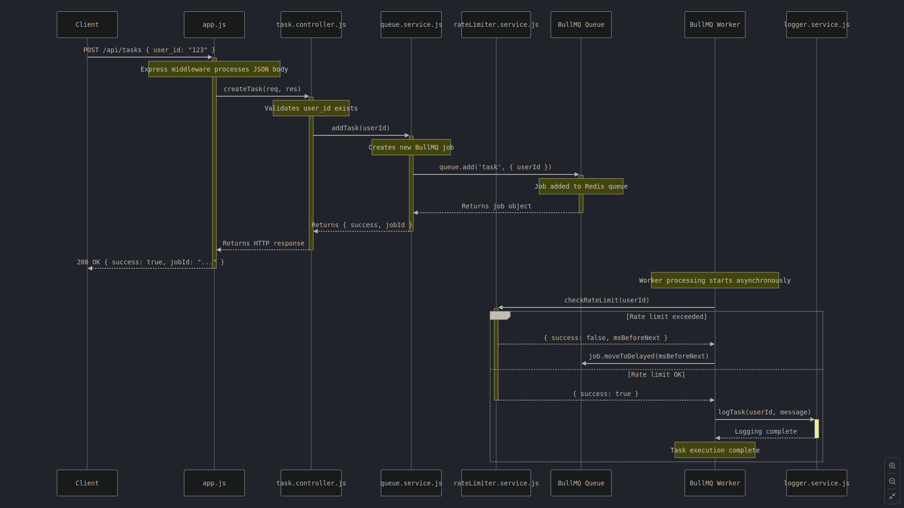

# Task Queue System with Rate Limiting

A Node.js application implementing a task queuing system with rate limiting capabilities. The system handles user tasks with rate limits of 1 task per second and 20 tasks per minute per user.

## Features

- Task queuing with BullMQ
- Rate limiting (1/sec and 20/min per user)
- Redis-based storage
- Cluster mode support with PM2
- Comprehensive logging system
- Error handling and monitoring
- Health check endpoint
- Graceful shutdown handling

## System Architecture and Approach

### Overall Architecture


### Request Flow



### Key Components:

1. **Rate Limiter**

   - Uses Redis for distributed rate limiting
   - Maintains per-user counters
   - Handles both per-second and per-minute limits

2. **Task Queue**

   - BullMQ for reliable task queuing
   - Persistent storage in Redis
   - Handles delayed processing for rate-limited tasks

3. **Worker Process**

   - Processes queued tasks
   - Respects rate limits
   - Handles task retries

4. **Logger**
   - Centralized logging system
   - File-based logging
   - Structured log format

## Prerequisites

Before you begin, ensure you have the following installed:

- Node.js (v14 or higher)
- Redis (v6 or higher)
- PM2 (for cluster mode)

### System Requirements

```bash
Node.js >= 14.x
Redis >= 6.x
npm >= 6.x
```

## Installation

1. **Clone the Project**

```bash
git clone https://github.com/Rishabh-Kumar01/rishabh-kumar-fintarget-assigment.git
cd rishabh-kumar-fintarget-assigment
```

2. **Install dependencies**

```bash
npm install -g pm2
```

```bash
npm install
```

3. **Set up Redis**

- For Ubuntu/Debian:

```bash
sudo apt update
sudo apt install redis-server
sudo systemctl start redis-server
```

- For macOS:

```bash
brew install redis
brew services start redis
```

- For Windows:
  Download and install from [Redis Windows Downloads](https://github.com/microsoftarchive/redis/releases)

[Rest of the installation steps remain the same...]

## Project Structure Explanation

````
project/
├── src/
│   ├── config/          # Configuration files
│   │   ├── redis.js     # Redis connection setup
│   ├── controllers/     # Request handlers
│   │   └── task.controller.js
│   ├── services/       # Business logic
│   │   ├── queue.service.js      # Task queue management
│   │   ├── rateLimiter.service.js # Rate limiting logic
│   │   └── logger.service.js     # Logging service
│   └── app.js          # Application entry point
├── logs/               # Application logs
├── .env               # Environment variables
└── package.json       # Project dependencies
```## Error Handling

The application includes comprehensive error handling for:
- Rate limit exceeded
- Invalid requests
- Server

### Component Interactions

1. **Request Flow**:
   - Client sends POST request to `/api/tasks`
   - Request is load-balanced across Node instances
   - Rate limiter checks request limits
   - Task is either processed or queued

2. **Rate Limiting Process**:
   - Each user has two rate limit counters:
     - Per-second counter (1 request/second)
     - Per-minute counter (20 requests/minute)
   - Counters are stored in Redis for distributed access
   - Exceeded limits trigger task queuing

3. **Task Processing**:
   - Tasks within rate limits are processed immediately
   - Rate-limited tasks are queued with a delay
   - Workers process queued tasks when limits allow
   - All task completions are logged

[Rest of the sections remain the same...]

## Testing the API

Using curl:
```bash
curl -X POST \
  http://localhost:3000/api/v1/tasks \
  -H 'Content-Type: application/json' \
  -d '{"user_id": "123"}'
````

Using POSTMAN:

1. Create a new POST request
2. URL: `http://localhost:3000/api/v1/tasks`
3. Headers: `Content-Type: application/json`
4. Body: Raw JSON

```json
{
  "user_id": "123"
}
```
